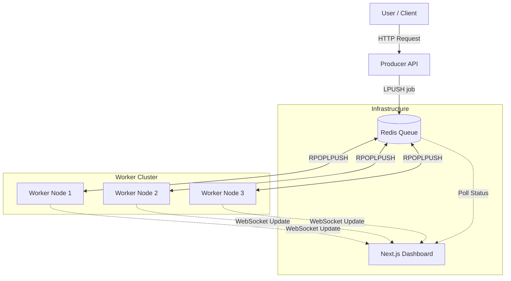

# 🚀 Distributed Task Scheduler & Monitor

A high-throughput, fault-tolerant distributed system capable of handling concurrent background jobs with zero data loss. Includes a real-time dashboard for monitoring system health.

---

## 🍔 The Concept: "The Kitchen Analogy"

Understanding distributed systems can be complex. Think of this application like a busy restaurant kitchen:

1.  **The Producer (The Cashier):** \* _Real World:_ Takes orders from customers instantly.
    - _This App:_ An API that accepts jobs and places them on the "Ticket Rail" (Redis Queue). It handles high traffic without slowing down.
2.  **The Queue (The Ticket Rail):** \* _Real World:_ Holds the orders in line so no request is lost.
    - _This App:_ A Redis list that acts as a buffer between the fast API and the heavy processing.
3.  **The Workers (The Chefs):** \* _Real World:_ They grab tickets one by one and cook the meal. If the restaurant gets busy, you hire more chefs.
    - _This App:_ Node.js microservices that pick up jobs, process them, and mark them as done. This system scales horizontally—you can spin up 100 workers with one command.

---

## 📸 System Architecture

