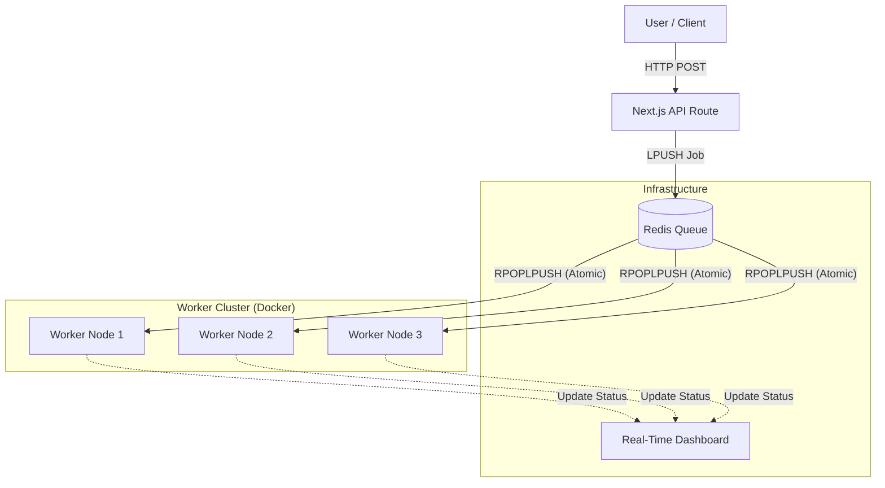

# 🔥 Distributed Grill: High-Throughput Task Scheduler

> **A real-time visualization of a fault-tolerant, microservices-based job queue system.**

## 💡 The Concept

This project demonstrates **Distributed System Architecture** by visualizing background jobs as "Food Orders" in a busy restaurant.

Instead of a boring list of logs, it uses a **Mission Control Dashboard** to show how high-volume requests are queued, processed by parallel worker nodes, and completed—all in real-time.

**It answers the question:** _"How do companies like Uber or DoorDash handle millions of requests without crashing?"_

---

## 🏗️ System Architecture

The system uses a **Producer-Consumer** pattern with **Redis** serving as the reliable message broker between the Next.js frontend (Producer) and the Node.js Microservices (Consumers).

